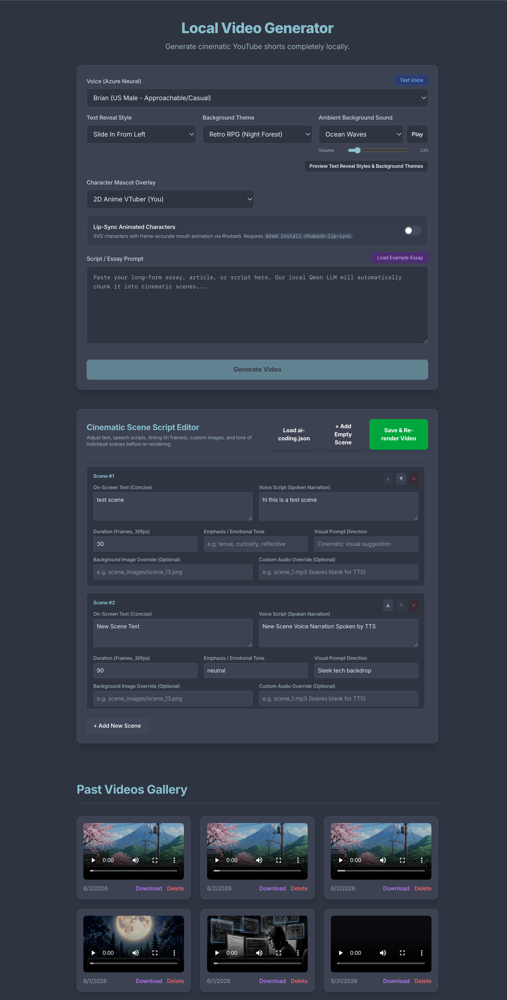

# 🎬 Remotion Video Generator

An AI-powered **local video generator** built with [Remotion](https://www.remotion.dev/). Feed it a JSON script, generate voiceovers via TTS, and render cinematic short videos — entirely on your local machine, no cloud rendering fees.

<p align="center">
  
</p>

---

## 📸 Screenshots



---

## ✨ Features

- **9 Background Styles** — glowing orb, tech grid, aurora, nebula, starfield, matrix rain, sunset vapor, gradient flow, solid minimal
- **3 RPG/Game Styles** — game-rpg, game-rpg-anime, game-rpg-forest (visual novel style with dialog boxes)
- **8 Text Reveal Animations** — sentence, word, typewriter, char-pop, slide-left, karaoke, glitch, blur-in
- **2 TTS Engines** — Microsoft Edge TTS (cloud, free) + Kokoro (local, offline)
- **Cartoon Voice Presets** — chipmunk, gravel, nasal (via Kokoro + ffmpeg pitch shifting)
- **7 Built-in SVG Characters** — narrator, professor, hacker, analyst, creative, executive, + custom
- **2 Sprite Characters** — pixel-user (8-bit), anime-vtuber (2D anime)
- **Lip-Sync Support** — via [Rhubarb Lip Sync](https://github.com/DanielSWolf/rhubarb-lip-sync) with 6 viseme shapes
- **Ambient Background Audio** — 10 loopable audio tracks (rain, lofi, ocean, fire, cinematic, etc.)
- **Ken Burns image effects** — zoom/pan on scene images
- **Audio-reactive glow** — character glow pulses with voice volume

---

## 🖥️ System Requirements

| Tool | Required | Notes |
|------|----------|-------|
| Node.js ≥ 18 | ✅ | For Remotion and scripts |
| Python ≥ 3.10 | ✅ | For TTS and image processing |
| ffmpeg | ✅ | For audio conversion (`brew install ffmpeg`) |
| Local LLM server | ⚠️ For UI only | Required only when using the SignalStack UI to draft scenes from a prompt. Not needed for CLI usage or manually written scenes. |
| Kokoro TTS | Optional | For offline TTS — requires separate conda env |
| Rhubarb Lip Sync | Optional | Only for `enableLipSync: true` |

---

## 🚀 Installation

### 1. Install Node Dependencies

```bash
npm install
```

### 2. (UI Only) Set Up a Local LLM Server

> [!IMPORTANT]
> A local LLM is **only required when using the SignalStack frontend UI** to auto-draft scenes from a prompt. If you write your scenes manually (JSON or Scene Editor), **no LLM is needed**.

The UI calls a local OpenAI-compatible API at `http://127.0.0.1:8081`. Any server that speaks the OpenAI Chat Completions format works. The default model is **Qwen 3.5 4B**.

**Option A — MLX (Apple Silicon, recommended)**
```bash
pip install mlx-lm
mlx_lm.server --model mlx-community/Qwen2.5-3B-Instruct-4bit --port 8081
```

**Option B — Ollama**
```bash
brew install ollama
ollama pull qwen2.5:3b
OLLAMA_HOST=127.0.0.1:8081 ollama serve
```

**Option C — LM Studio / any OpenAI-compatible server**
Point the server to port `8081` and load any capable model (3B+ recommended).

If the LLM server is not running when you click "Generate Video", the request will fail at the drafting step. You can still use the **Cinematic Scene Script Editor** tab to write and render scenes manually — no LLM required.

### 3. Set Up Python Virtual Environment

```bash
python3 -m venv venv
source venv/bin/activate       # macOS/Linux
# venv\Scripts\activate        # Windows

pip install -r requirements.txt
```

### 4. Install ffmpeg (required)

```bash
brew install ffmpeg            # macOS
# sudo apt-get install ffmpeg  # Ubuntu/Linux
```

### 5. (Optional) Kokoro Local TTS

Kokoro runs offline, producing higher-quality voices than Edge TTS, but requires a separate conda environment:

```bash
conda create -n kokoro python=3.10
conda activate kokoro
pip install kokoro soundfile numpy
brew install espeak-ng         # macOS
# sudo apt-get install espeak-ng  # Linux
```

Tell the generator where to find Kokoro Python:
```bash
export KOKORO_PYTHON=~/miniconda3/envs/kokoro/bin/python
```

### 6. (Optional) Rhubarb Lip Sync

Required only if using `"enableLipSync": true`.

```bash
brew install rhubarb-lip-sync  # macOS
```

Or download the binary from the [Rhubarb releases page](https://github.com/DanielSWolf/rhubarb-lip-sync/releases) and place it at:
```
~/.local/Rhubarb-Lip-Sync-1.14.0-macOS/rhubarb
```

---

## ⚡ Quick Start

### Step 1 — Write Your Script

Create a JSON data file (see [Data Schema](#-data-schema) below). Or use the included example:

```bash
cp sample-data.json my-video.json
# edit my-video.json with your scenes
```

### Step 2 — Generate Audio (TTS)

```bash
node generate_assets.mjs my-video.json
```

This reads each scene's `voice` text, calls the TTS engine, and saves MP3 files to `public/`.

### Step 3 — Preview in Remotion Studio

```bash
npm run dev
```

Open `http://localhost:3000` to preview and tweak your video interactively.

### Step 4 — Render the Final Video

```bash
node render.mjs my-video.json
```

The rendered MP4 is saved to `out/pulse-<timestamp>.mp4`.

---

## 📋 Data Schema

Your input JSON file defines the full video. Here's a complete example:

```json
{
  "textRevealStyle": "sentence",
  "backgroundStyle": "glowing-orb",
  "backgroundAudio": "lofi",
  "ambientVolume": 20,
  "characterMascot": "none",
  "enableLipSync": false,
  "voiceEngine": "edge",
  "voiceName": "en-US-BrianNeural",
  "scenes": [
    {
      "text": "The text shown on screen",
      "voice": "The full narration spoken by the TTS voice",
      "duration": 120,
      "emphasis": "neutral",
      "audioFile": "scene_0.mp3",
      "imageFile": "",
      "characterId": "narrator",
      "bodyPose": "neutral",
      "expression": "neutral"
    }
  ]
}
```

### Top-Level Fields

| Field | Type | Default | Description |
|-------|------|---------|-------------|
| `textRevealStyle` | `string` | `"sentence"` | How text animates onto screen |
| `backgroundStyle` | `string` | `"glowing-orb"` | Visual background style |
| `backgroundAudio` | `string` | `"none"` | Ambient looping audio track |
| `ambientVolume` | `number` | `12` | Ambient audio volume (0–100) |
| `characterMascot` | `string` | `"none"` | Static mascot image preset |
| `enableLipSync` | `boolean` | `false` | Enable Rhubarb lip-sync on characters |
| `voiceEngine` | `string` | `"edge"` | TTS engine: `"edge"` or `"kokoro"` |
| `voiceName` | `string` | `"en-US-BrianNeural"` | Voice ID for the engine |

### Scene Fields

| Field | Type | Required | Description |
|-------|------|----------|-------------|
| `text` | `string` | ✅ | Text displayed on screen |
| `voice` | `string` | ✅ | Full narration text spoken by TTS |
| `duration` | `number` | ✅ | Estimated duration in frames (overridden by actual audio length) |
| `emphasis` | `string` | ✅ | Tone hint: `neutral`, `tense`, `impact`, `release`, `curiosity`, `reflective` |
| `audioFile` | `string` | ✅ | Output audio filename (e.g. `scene_0.mp3`) — relative to `public/` |
| `imageFile` | `string` | ❌ | Optional scene image (relative to `public/`) |
| `characterId` | `string` | ❌ | Character to display (see [Characters](#-characters--mascots)) |
| `visemeFile` | `string` | ❌ | Lip-sync data file (relative to `public/`) |
| `bodyPose` | `string` | ❌ | `neutral`, `thinking`, `excited`, `concerned`, `pointing` |
| `expression` | `string` | ❌ | `neutral`, `happy`, `serious`, `surprised`, `thoughtful` |

---

## 🎨 Background Styles

| Value | Description |
|-------|-------------|
| `glowing-orb` | Dark background with animated glowing orb + subtle grid |
| `tech-grid` | Perspective grid scrolling into the distance |
| `solid-minimal` | Clean solid dark background with a subtle top gradient |
| `starfield` | Twinkling star field with color nebula |
| `aurora` | Soft aurora borealis blobs with deep purple/cyan |
| `nebula` | Rotating colored nebula clouds |
| `gradient-flow` | Continuously cycling hue-shifted gradient |
| `matrix-rain` | Green Matrix-style cascading characters |
| `sunset-vapor` | Synthwave sunset with retro grid and sun |
| `game-rpg` | Visual novel style — night forest background |
| `game-rpg-anime` | Visual novel style — anime country road background |
| `game-rpg-forest` | Visual novel style — forest background (same as game-rpg) |

---

## ✍️ Text Reveal Styles

| Value | Description |
|-------|-------------|
| `sentence` | Lines slide up one by one |
| `word` | Words spring in individually |
| `typewriter` | Characters typed out with blinking cursor |
| `char-pop` | Each character pops + rotates in |
| `slide-left` | Words slide in from the left |
| `karaoke` | Active word highlighted; past words dimmed |
| `glitch` | Chromatic aberration glitch effect |
| `blur-in` | Lines materialize from blur to sharp |

---

## 🔊 TTS Engines & Voices

### Edge TTS (default — cloud, free, no API key)

Uses Microsoft's neural TTS. Requires internet connection.

```json
{ "voiceEngine": "edge", "voiceName": "en-US-BrianNeural" }
```

Popular voices: `en-US-BrianNeural`, `en-US-AndrewNeural`, `en-US-JennyNeural`, `en-US-GuyNeural`, `en-US-AvaNeural`

List all available voices:
```bash
source venv/bin/activate
python -c "import asyncio, edge_tts; asyncio.run(edge_tts.list_voices())" | python -m json.tool | grep ShortName
```

### Kokoro TTS (optional — local, offline)

Higher-quality, offline synthesis. Requires the Kokoro conda environment (see [Installation](#installation)).

```json
{ "voiceEngine": "kokoro", "voiceName": "am_adam" }
```

Available voices: `af_heart`, `af_bella`, `am_adam`, `am_puck`, `am_fenrir`, `am_michael`, `bf_emma`, `bm_george`

### Cartoon Voice Presets

Built-in voice presets that apply pitch/tempo shifts via ffmpeg:

| Voice ID | Description |
|----------|-------------|
| `cartoon-chipmunk` | High-pitched, fast chipmunk voice |
| `cartoon-gravel` | Deep, slow gravelly voice |
| `cartoon-nasal` | Mid-pitched, slightly nasal voice |

```json
{ "voiceEngine": "kokoro", "voiceName": "cartoon-chipmunk" }
```

---

## 🧑‍🎤 Characters & Mascots

### SVG Characters (procedurally rendered, fully animated)

These are built-in vector characters with idle animations, expression changes, and audio-reactive glow:

| ID | Name | Personality |
|----|------|-------------|
| `narrator` | The Narrator | Calm, authoritative storyteller |
| `professor` | Professor | Intellectual, explains complex topics |
| `hacker` | Hacker | Fast-talking, cyberpunk, excited about tech |
| `analyst` | Analyst | Data-driven, precise, factual |
| `creative` | Creative | Enthusiastic, warm, energetic |
| `executive` | Executive | Confident, business-focused, direct |

### Sprite Characters (sprite sheet animation)

| ID | Description |
|----|-------------|
| `pixel-user` | 8-bit retro gaming pixel art character |
| `anime-vtuber` | 2D anime VTuber in Demon Slayer style |

Sprite sheets are loaded from `public/`:
```
public/anime_user_spritesheet.png          # idle
public/anime_user_spritesheet_excited.png  # excited pose
public/anime_user_spritesheet_pointing.png # pointing pose
public/anime_user_spritesheet_thinking.png # thinking pose
```

### Static Mascot Images

For non-animated mascot images, set `characterMascot` in the top-level config:

| Value | Files needed in `public/` |
|-------|--------------------------|
| `developer` | `developer_neutral.png`, `developer_thinking.png`, `developer_intense.png` |
| `cyberpunk` | `cyberpunk_neutral.png`, `cyberpunk_thinking.png`, `cyberpunk_intense.png` |
| `custom` | Set `customCharacterUrl` to any image URL |

---

## 🎵 Ambient Background Audio

Place audio files in `public/`. The following filenames are recognised automatically:

| Value | File |
|-------|------|
| `rain` | `rain.mp3` |
| `nature` | `nature.mp3` |
| `office` | `office.mp3` |
| `lofi` | `lofi.mp3` |
| `ocean` | `ocean.mp3` |
| `fire` | `fire.mp3` |
| `whitenoise` | `whitenoise.mp3` |
| `deepspace` | `deepspace.mp3` |
| `heartbeat` | `heartbeat.mp3` |
| `cinematic` | `cinematic.mp3` |

---

## 🔄 Lip-Sync Workflow

For animated mouth sync with Rhubarb:

1. Ensure Rhubarb is installed (see [Installation](#installation))
2. Set `"enableLipSync": true` in your data file
3. Set `"voiceEngine": "edge"` (Kokoro output must be converted to WAV first)
4. After `generate_assets.mjs` runs, generate viseme data:

```bash
source venv/bin/activate

# For each scene (Rhubarb needs a WAV, not MP3):
ffmpeg -i public/scene_0.mp3 public/scene_0.wav
python generate_lipsync.py public/scene_0.wav public/scene_0_visemes.json

# Add to your scene data:
# "visemeFile": "scene_0_visemes.json"
```

---

## 🛠️ Scripts Reference

| Script | Command | Description |
|--------|---------|-------------|
| Preview Studio | `npm run dev` | Open Remotion Studio at `localhost:3000` |
| Generate Audio | `node generate_assets.mjs [data.json]` | Run TTS for all scenes |
| Render Video | `node render.mjs [data.json]` | Headless render to `out/` |
| Lip Sync | `python generate_lipsync.py <wav> <output.json>` | Generate viseme data |
| Remove BG | `python remove_bg.py <input.png> <output.png>` | Flood-fill black background removal |
| Lint | `npm run lint` | ESLint + TypeScript check |

---

## 📁 Project Structure

```
remotion-video-generator/
├── src/
│   ├── Root.tsx              # Remotion root + Zod schema definitions
│   ├── PulseVideo.tsx        # Main video composition (all scenes)
│   ├── LipSyncCharacter.tsx  # SVG character with lip-sync
│   ├── PixelCharacter.tsx    # Sprite-sheet character renderer
│   ├── GameDialogBox.tsx     # RPG-style dialog box overlay
│   ├── characters.ts         # Character registry (IDs, voices, SVG config)
│   ├── useVisemeData.ts      # Hook for loading + interpolating viseme data
│   ├── viseme-shapes.ts      # SVG mouth shape paths for each phoneme
│   └── index.ts              # Remotion entry point
├── public/                   # Static assets (audio, images) — served by Remotion
├── generate_assets.mjs       # TTS audio generation script (Node)
├── generate_audio.py         # TTS backend: Edge TTS + Kokoro dispatcher
├── generate_audio_kokoro.py  # Kokoro TTS implementation
├── generate_lipsync.py       # Rhubarb lip-sync wrapper
├── remove_bg.py              # Background removal utility
├── render.mjs                # Headless video render script
├── sample-data.json          # Minimal example data file
├── ai-coding.json            # Example: AI coding debate video
├── mars-data.json            # Example: Mars exploration video
├── remotion.config.ts        # Remotion config (Tailwind, output format)
├── requirements.txt          # Python dependencies
└── tsconfig.json             # TypeScript config
```

---

## 📊 Example Data Files

| File | Description |
|------|-------------|
| `sample-data.json` | Minimal 1-scene test — start here |
| `ai-coding.json` | Full multi-scene video: AI coding debate (40+ scenes) |
| `mars-data.json` | Full multi-scene video: Mars exploration narrative |

---

## 🤝 Contributing

1. Fork the repo
2. Create your feature branch: `git checkout -b feat/my-feature`
3. Commit your changes: `git commit -m 'feat: add my feature'`
4. Push: `git push origin feat/my-feature`
5. Open a Pull Request

---

## 📄 License

This project is private and unlicensed.

Note: Remotion itself requires a company license for certain use cases. [Read the Remotion license terms](https://github.com/remotion-dev/remotion/blob/main/LICENSE.md).
